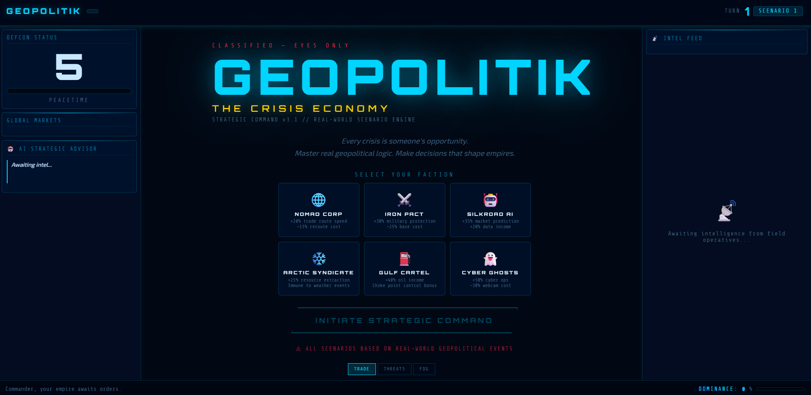
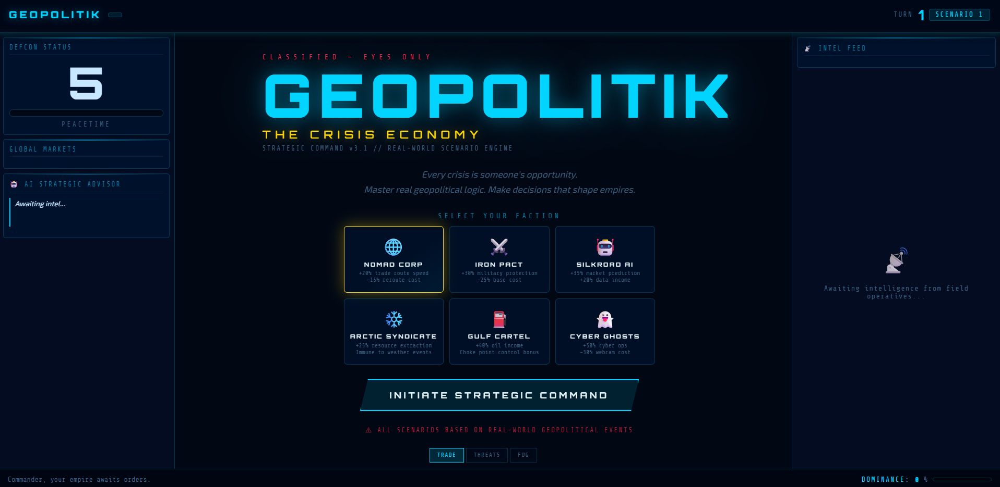
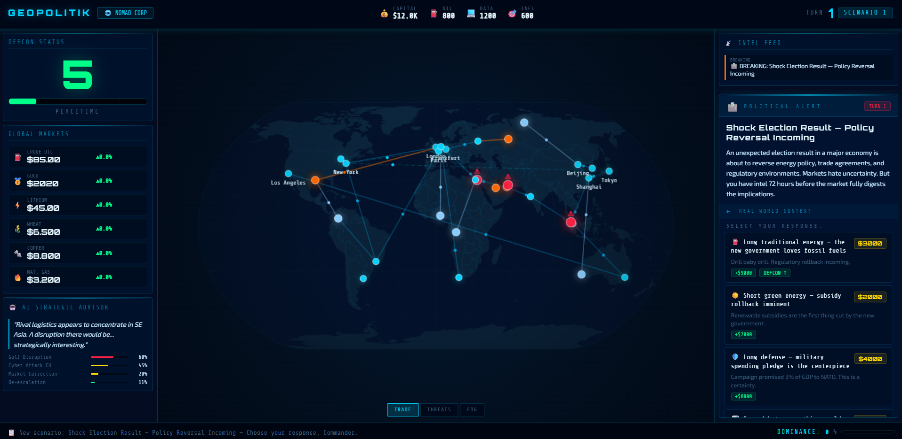
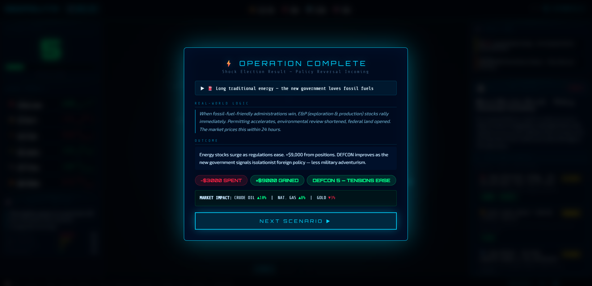
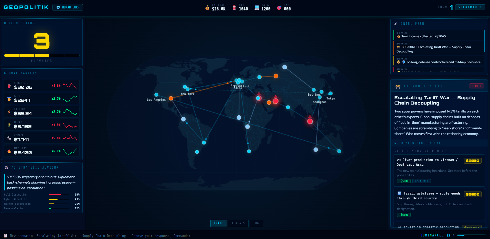

# Geopolitik: The Crisis Economy

**Geopolitik: The Crisis Economy** is a strategic economic and geopolitical simulator where players act as shadow megacorporations or superpowers. The goal is to build a resilient global supply chain that thrives on the instability of other nations, achieving global market dominance without triggering global annihilation or suffering complete economic collapse.

## Key Features

- **Scenario-Driven Gameplay**: Every turn presents a high-stakes scenario based on actual geopolitical events (OPEC cuts, Red Sea attacks, SWIFT sanctions, etc.).
- **Global Consequence Logic**: Each choice explains the "Real-World Logic" behind geopolitical and economic mechanics.
- **GPS-Accurate World Map**: Interactive world map with real latitude/longitude for all major global hubs, rendered using a precise `d3-geo` projection.
- **Dynamic Market Simulation**: Live commodity prices (Oil, Gold, Lithium, etc.) that react to global events and player decisions.
- **Crisis Dashboard**: A premium military/cyber-themed interface featuring dedicated scenario cards, consequence explainers, and real-time strategic monitoring.

## Preview


*Establish your strategic command*


*Select your global power*


*The Crisis Dashboard in action*


*High-stakes geopolitical scenarios*


*Real-world logic and consequences*

## Tech Stack

- **Build Tool**: [Vite](https://vitejs.dev/)
- **Logic**: Vanilla JavaScript (ES Modules)
- **Mapping**: [D3-geo](https://d3js.org/d3-geo) & [TopoJSON](https://github.com/topojson/topojson)
- **UI & Styling**: Vanilla CSS and HTML5

## Getting Started

### Prerequisites

- [Node.js](https://nodejs.org/) (v16.0.0 or higher)
- npm (v7.0.0 or higher)

### Installation

1. Clone the repository:
   ```bash
   git clone https://github.com/YOUR_USERNAME/geopolitik-crisis-economy.git
   cd geopolitik-crisis-economy
   ```

2. Install dependencies:
   ```bash
   npm install
   ```

3. Run the development server:
   ```bash
   npm run dev
   ```

4. Open your browser and navigate to `http://localhost:5173`.

## Gameplay

- **Select a Faction**: Choose from 6 unique factions, each with its own special bonuses and starting resources.
- **Respond to Scenarios**: Read incoming intelligence reports and select the best strategic response.
- **Manage DEFCON**: Keep global tensions in check. Reaching DEFCON 1 results in global catastrophe.
- **Market Dominance**: Increase your capital and strategic influence to achieve 100% market dominance to win.

## License

This project is licensed under the MIT License - see the [LICENSE](LICENSE) file for details.

## Credits

Developed as a modern strategic simulator inspired by high-stakes geopolitical analysis.
